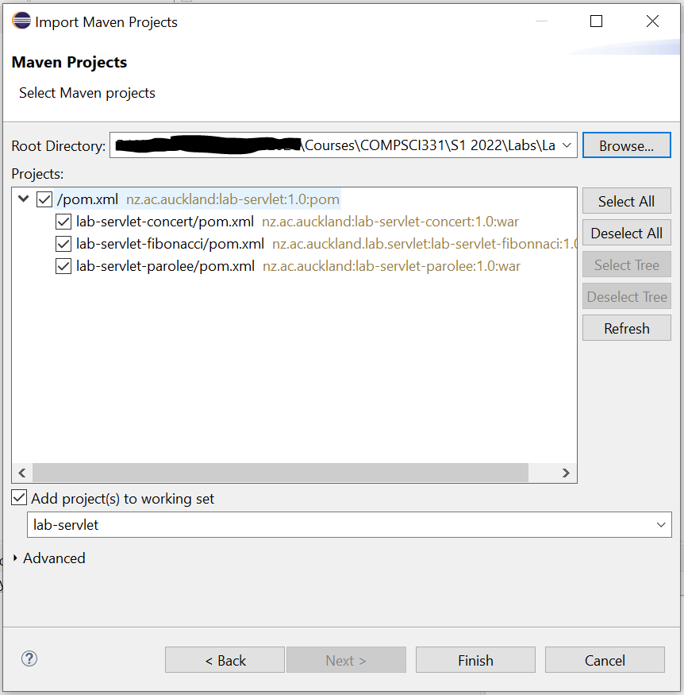

## Importing Maven Projects ##

Maven's POM file contains all information necessary to structure a project and identify its dependencies. Many modern IDEs such as IntelliJ and Eclipse allow developers to easily import Maven projects. This allows individual developers to use their IDE of choice. Furthermore, in combination with a properly specified `.gitignore` file, developers need not commit IDE-specific configuration files to their repositories - the `pom.xml` files are sufficient.

Instructions for importing Maven projects into both Eclipse and IntelliJ are given here. Feel free to use whichever IDE you prefer for this course.

There will be occassions where what is distributed to you will have multiple `pom.xml` files. In this case there will be on "top level" or "parent" file, and others in sub-directories. Sometimes the actions you perform (e.g. importing to IDEs) will be performed on the top-level `pom.xml` and sometimes on the file in the sub-directory.

### IntelliJ:

Select `File -> Open` from the menu, or simply `Open` from the welcome screen. From there, browse to the main project folder (the one with the parent `pom.xml` file), and locate and select the `pom.xml` file within that folder to open, as shown in the below screenshot.

IntelliJ may prompt you, asking whether to open the file `as a project` or `as a file`. Choose `as a project`. If you have already opened the project in IntelliJ in the past, you may also be prompted asking whether to open the existing project or create a new project. In this case, choose `open existing project`.

IntelliJ will take care of loading the provided Maven project, and any of its child projects, as IntelliJ projects / modules as appropriate. Standard IntelliJ files such as `.idea` and `*.iml` will be created - these need not be committed to your repository and thus are included in the `.gitignore`.

### Eclipse:

**Note:** When using Eclipse, **do NOT** clone your repo directly into your Eclipse workspace. Doing so may produce unintended consequences. Instead, clone your repo to a separate directory, and use this process to link your Eclipse workspace with the projects in your repo. 

Within Eclipse, choose `File -> Import -> Existing Maven Projects` as shown in the below screenshot.

As the *root directory*, select the folder containing the parent `pom.xml` file. You should see the POM, along with any child POMs, as shown in the screenshot below. Click `Finish` and all these projects will be imported into your Eclipse workspace.

**Note:** Importing a project does not make a copy of the project in your Eclipse workspace directory - the actual source code, `pom.xml` files and other artifacts will remain in the directory in which you cloned your repository. This is good, and expected. It is typical that a workspace directory contains only Eclipse metadata.

## Build and run the project

Using Maven, build the complete project. The easiest way to do this is to run a Maven goal, e.g. `package`, on the POM file. Depending on the setup of the project, you may have to do this on the parent `pom.xml` or one in the relevant sub-directory. In the IDEs there will typically be options from the right-mouse menu for doing so.
